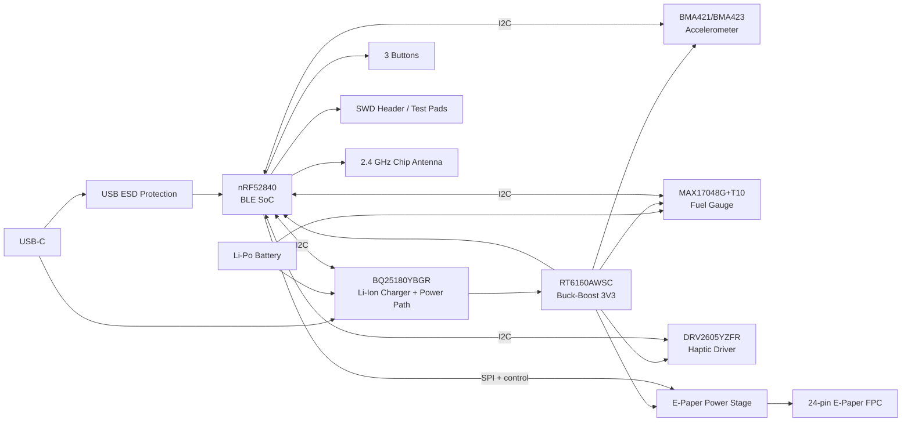

# InkTime

Smartwatch open-source bazat pe **nRF52840**, proiectat pentru cursul TSC. Acest repository conține partea de hardware, manufacturing și integrare mecanică pentru varianta **InkTime**.

> **Notă importantă**  
> `BOM.csv` din acest repo este un **BOM de documentație** pentru componentele critice și pentru secțiunea din README.  
> **BOM-ul final de fabricație** trebuie exportat din Fusion/EAGLE după ce schematic-ul și PCB-ul sunt finalizate, pentru a include toate pasivele, orientările și footprint-urile finale.

---

## Structura repository-ului

```text
Hardware/
  - schematic (.sch)
  - board (.brd)

Manufacturing/
  - gerbers.zip
  - Bill of Materials (.bom / .csv)
  - Pick and Place (.cpl)

Mechanical/
  - ansamblu complet (.step)
  - fișierul Fusion360 al ansamblului complet

Images/
  - randări PCB
  - randări assembly
  - capturi schematic / board

LICENSE
README.md
```

---

## Stare proiect

- [x] structură repo
- [x] schelet README
- [x] BOM de documentație pentru componentele critice
- [ ] schematic complet
- [ ] ERC curat
- [ ] board complet
- [ ] DRC cu fișierul oficial
- [ ] gerbers / BOM / CPL exportate
- [ ] model 3D complet: PCB + baterie + display + shaker + carcasă
- [ ] review DVT
- [ ] fix-uri pentru GNG

---

## Block diagram



---

## Arhitectură hardware

### 1. Microcontroller + radio
Controllerul principal este **nRF52840** în capsulă QFN/AQFN, folosit pentru:
- controlul întregului sistem;
- comunicare BLE;
- interfața USB;
- I2C pentru PMIC / IMU / fuel gauge / haptic;
- SPI + semnale de control pentru display-ul e-paper;
- SWD pentru debug și programare.

Blocul radio folosește:
- cristal de **32 MHz** pentru radio;
- cristal de **32.768 kHz** pentru timp real / low power;
- rețea de adaptare RF;
- antenă chip **2450AT18B100E**.

### 2. Alimentare
Alimentarea este împărțită în două etape:
- **BQ25180YBGR** pentru încărcarea bateriei Li-Po și power-path;
- **RT6160AWSC** pentru generarea tensiunii principale de **3V3**.

Această separare permite:
- alimentare din USB;
- încărcare baterie;
- distribuție stabilă de 3V3 pentru MCU și periferice.

### 3. Senzori și periferice
- **BMA421/BMA423** – accelerometru low-power pentru detecție mișcare / gesturi;
- **MAX17048G+T10** – fuel gauge pentru estimarea stării bateriei;
- **DRV2605YZFR** – driver haptic pentru feedback tactil;
- **E-paper connector + drive stage** – interfața către display-ul principal;
- **3 butoane** – interfață fizică utilizator;
- **USB-C + ESD** – alimentare și comunicare USB.

---

## Interfețe și mapare pini nRF52840

> **Notă**  
> Tabelul de mai jos este construit din schema curentă și este suficient pentru documentarea de review.  
> Înainte de predare, trebuie reverificat 1:1 cu schematic-ul final și actualizat dacă apar modificări.

| Funcție | Net / semnal | Pin nRF52840 | Motiv |
|---|---|---:|---|
| I2C data | SDA | P0.06 | magistrală comună pentru PMIC, IMU, fuel gauge, haptic |
| I2C clock | SCL | P0.07 | magistrală comună pentru PMIC, IMU, fuel gauge, haptic |
| PMIC interrupt | PMIC_INT | P0.11 | evenimente încărcare / power-path |
| IMU interrupt 1 | IMU_INT1 | P0.08 | semnal de întrerupere de la accelerometru |
| IMU interrupt 2 | IMU_INT2 | P1.08 | al doilea semnal de întrerupere de la accelerometru |
| Haptic enable / trigger | HAPTIC_EN | P0.12 | controlul driverului DRV2605 |
| Fuel gauge alert | ALERT | P0.10 / NFC2 | semnal alertă baterie / SOC |
| USB VBUS detect | VBUS | VBUS pin dedicat | detectare prezență USB |
| USB data minus | D- | D- pin dedicat | USB 2.0 |
| USB data plus | D+ | D+ pin dedicat | USB 2.0 |
| Display chip select | EPD_CS | P0.05 | selectare SPI pentru e-paper |
| Display data/command | EPD_DC | P0.15 | diferențiere date/comenzi |
| Display busy | EPD_BUSY | P0.16 | status busy din display |
| Display reset | EPD_RST | P0.17 | reset hardware display |
| User button UP | SW_UP | P1.15 | input utilizator |
| User button ENTER | SW_ENT | P0.14 | input utilizator |
| User button DOWN | SW_DN | P1.02 | input utilizator |
| E-paper power enable | GPIO pentru Q1 | P1.01 | comandă alimentarea blocului e-paper |
| SWD data | SWDIO | SWDIO pin dedicat | debug/programare |
| SWD clock | SWDCLK | SWDCLK pin dedicat | debug/programare |
| Trace / debug | SWO | GPIO debug | punct de test pentru debugging |

### Observații pe maparea pinilor
- Magistrala **I2C** este comună și reduce numărul total de pini ocupați.
- Interfața USB folosește pinii dedicați ai nRF52840 pentru compatibilitate corectă.
- Semnalele către e-paper sunt separate între control (`EPD_CS`, `EPD_DC`, `EPD_RST`, `EPD_BUSY`) și alimentare.
- Butoanele sunt conectate pe GPIO-uri separate pentru tratare simplă în firmware.
- Semnalele de debug sunt expuse atât prin conectorul SWD, cât și prin test pad-uri.

---

## Funcționalitatea fiecărui bloc

### nRF52840
- MCU principal;
- BLE;
- USB FS;
- interfețe I2C / SPI / GPIO;
- control low-power.

### BQ25180YBGR
- încărcare baterie Li-Ion/LiPo;
- power-path management;
- monitorizare și configurare prin I2C.

### RT6160AWSC
- buck-boost I2C-programmable;
- generează 3V3 din sursa sistemului;
- menține tensiunea stabilă pentru subsisteme.

### BMA421/BMA423
- accelerometru digital ultra-low-power;
- detectare mișcare / activitate;
- întreruperi dedicate către MCU.

### MAX17048G+T10
- fuel gauge pentru baterie LiPo;
- măsoară tensiunea și estimează state-of-charge;
- alertă low battery către MCU.

### DRV2605YZFR
- driver haptic pentru actuator ERM/LRA;
- controlabil prin I2C;
- permite feedback tactil complex.

### USB-C + ESD
- alimentare și date USB;
- rezistențe de configurare CC;
- protecție ESD pe D+/D-/VBUS.

### E-paper drive + connector
- conector FPC de 24 pini;
- etapă de alimentare și comandă pentru display;
- linii SPI/control către MCU.

---

## BOM de documentație

BOM-ul de mai jos conține **componentele critice**. Pentru BOM-ul complet de producție trebuie folosit exportul din Fusion/EAGLE.

| RefDes | Componentă | MPN | Qty | Observații |
|---|---|---|---:|---|
| U1 | BLE SoC | NRF52840-QIAA-R / QIAA-T | 1 | MCU principal |
| IC1 | Charger + power path | BQ25180YBGR | 1 | management baterie |
| IC9 | Buck-boost converter | RT6160AWSC | 1 | 3V3 principal |
| IC3 | IMU | BMA421 / BMA423 | 1 | biblioteca folosită conține BMA423 |
| U3 | Fuel gauge | MAX17048G+T10 | 1 | monitorizare baterie |
| IC2 | Haptic driver | DRV2605YZFR | 1 | control vibrații |
| J4 | USB-C | KH-TYPE-C-16P | 1 | alimentare + USB |
| D3 | ESD USB | USBLC6-2SC6Y | 1 | protecție D+/D-/VBUS |
| J1 | E-paper FPC | 503480-2400 | 1 | conector display |
| ANT1 | Chip antenna 2.4 GHz | 2450AT18B100E | 1 | BLE antenna |
| J2 | SWD header | TC2030-IDC | 1 | programare / debug |
| D2,D4,D5 | Schottky diode | MBR0530 | 3 | bloc power e-paper |
| Q3 | N-MOS | SI1308EDL-T1-GE3 | 1 | drive e-paper |
| Q1 | P-MOS | DMG2305UX-7 | 1 | comutare alimentare e-paper |
| X1 | RF crystal | 32MHz | 1 | ceas radio |
| X2 | RTC crystal | 32.768kHz | 1 | low-power timing |
| L7 | Inductor DCDC | FTC252012SR47MBCA | 1 | buck-boost RT6160 |
| SW_UP, SW_ENT, SW_DN | Butoane tactile | TBD | 3 | verificare finală după layout |
| Battery | Li-Po battery | TBD | 1 | model 3D de desenat |
| Display | E-paper module | TBD | 1 | model 3D de desenat |
| Shaker | ERM/LRA actuator | TBD | 1 | model 3D de desenat |

Vezi și fișierul [`Manufacturing/BOM.csv`](Manufacturing/BOM.csv).

---

## Design rules și constrângeri care trebuie respectate

### PCB / mechanical
- grosime PCB: **1.0 mm**;
- componentele se amplasează **exclusiv pe TOP**;
- rutarea poate fi pe TOP și BOTTOM;
- trebuie **plan de masă pe TOP și pe BOTTOM**;
- dacă se folosesc 4 straturi, unul dintre straturile interne trebuie să fie GND;
- PCB-ul trebuie să intre în carcasa furnizată;
- USB-C, butoanele și conectorul display trebuie aliniate mecanic cu carcasa.

### RF
- antena trebuie plasată spre exteriorul plăcii;
- sub antenă **nu se pune plan de masă**;
- sub antenă **nu se routează semnale**;
- se recomandă via stitching în jurul planurilor de GND, în special în zona radio.

### Routing
- trasee de putere: **0.30 mm**;
- trasee de semnal: **minim 0.15 mm**;
- fără unghiuri de 90°;
- se evită vias pe traseele de putere, pe cât posibil;
- condensatoarele de 100nF trebuie puse cât mai aproape de pinii de alimentare.

### Verificări
- ERC obligatoriu;
- DRC obligatoriu cu fișierul de reguli din arhivă;
- eroarea **Only INPUT pins on NET ID** poate fi ignorată;
- erorile de **Dimension** cauzate de butoane și USB pot fi justificate conform cerinței.

### Silkscreen
- silkscreen-ul trebuie să fie lizibil;
- pe silkscreen se păstrează **numele componentelor**, nu valorile;
- test pad-urile trebuie marcate clar cu numele semnalelor.

---

## Packaging și reguli de selecție a pasivelor

Conform cerinței:
- toate rezistențele sunt SMD **0201**;
- condensatoarele cu valori **<= 100nF** sunt **0201**;
- condensatoarele cu valori **> 100nF** sunt **0402**, cu excepțiile specificate explicit în schemă.

---

## Manufacturing outputs

La final, repository-ul trebuie să conțină:

### Hardware
- `inktime.sch`
- `inktime.brd`

### Manufacturing
- `gerbers.zip`
- `BOM.csv` / `.bom`
- `Pick and Place .cpl`

### Mechanical
- ansamblu complet `STEP`
- fișierul Fusion360 al ansamblului complet

### Images
- randare PCB top
- randare PCB bottom
- randare assembly complet
- capturi schematic / board

---

## Design log / decizii

### Decizii luate până acum
- biblioteca utilizată: `InkTime_v5.lbr`;
- schema este implementată după modelul furnizat;
- pentru IMU se folosește simbolul / footprint-ul disponibil în bibliotecă (**BMA423**), urmând să fie menționat explicit în review și în BOM;
- BOM-ul din README este unul de documentație; BOM-ul final de asamblare va fi exportat direct din CAD.

### Probleme / aspecte de urmărit
- verificarea disponibilității finale la JLC pentru toate componentele critice;
- confirmarea exactă a modelului de baterie, display și shaker;
- verificarea finală a footprint-urilor pentru componentele foarte mici (WLCSP / DSBGA / AQFN);
- justificarea eventualelor erori DRC/Dimension acceptate conform cerinței.

---

## Imagini

Imaginile finale vor fi puse în `Images/`:
- `pcb_top.png`
- `pcb_bottom.png`
- `assembly_render.png`
- `schematic_page1.png`
- `schematic_page2.png`

---

## TODO până la predare

### EVT
- [ ] schematic complet
- [ ] PCB complet
- [ ] ERC
- [ ] DRC
- [ ] gerbers
- [ ] BOM
- [ ] CPL
- [ ] model 3D complet

### DVT
- [ ] review pe GitHub coleg
- [ ] issues pentru fiecare bug
- [ ] remedierea bug-urilor primite

### GNG
- [ ] repo complet
- [ ] documentație finală
- [ ] randări finale
- [ ] justificarea erorilor acceptate
