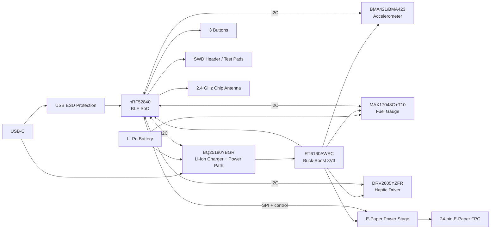

# InkTime

Smartwatch open-source bazat pe **nRF52840**, proiectat pentru cursul TSC. Acest repository contine partea de hardware, manufacturing si integrare mecanica pentru varianta **InkTime**.

---

## Structura repository-ului

```text
Hardware/
  - schematic (.sch)
  - board (.brd)

Manufacturing/
  - gerbers.zip
  - Bill of Materials (.bom / .csv)
  - Pick and Place (.cpl)

Mechanical/
  - ansamblu complet (.step)
  - fisierul Fusion360 al ansamblului complet

Images/
  - randari PCB
  - randari assembly
  - capturi schematic / board

LICENSE
README.md
```

---

## Stare proiect

- [x] structura repo
- [x] README completat
- [x] BOM de documentatie pentru componentele critice
- [x] schematic complet
- [x] ERC curat
- [x] board complet
- [x] DRC cu fisierul oficial
- [x] gerbers / BOM / CPL exportate
- [ ] model 3D complet: PCB + baterie + display + shaker + carcasa
- [ ] review DVT
- [ ] fix-uri pentru GNG

---

## Block diagram



---

## Arhitectura hardware

### 1. Microcontroller + radio
Controllerul principal este **nRF52840** in capsula QFN/AQFN, folosit pentru:
- controlul intregului sistem;
- comunicare BLE;
- interfata USB;
- I2C pentru PMIC / IMU / fuel gauge / haptic;
- SPI + semnale de control pentru display-ul e-paper;
- SWD pentru debug si programare.

Blocul radio foloseste:
- cristal de **32 MHz** pentru radio;
- cristal de **32.768 kHz** pentru timp real / low power;
- retea de adaptare RF;
- antena chip **2450AT18B100E**.

### 2. Alimentare
Alimentarea este impartita in doua etape:
- **BQ25180YBGR** pentru incarcarea bateriei Li-Po si power-path;
- **RT6160AWSC** pentru generarea tensiunii principale de **3V3**.

Aceasta separare permite:
- alimentare din USB;
- incarcare baterie;
- distributie stabila de 3V3 pentru MCU si periferice.

### 3. Senzori si periferice
- **BMA421/BMA423** - accelerometru low-power pentru detectie miscare / gesturi;
- **MAX17048G+T10** - fuel gauge pentru estimarea starii bateriei;
- **DRV2605YZFR** - driver haptic pentru feedback tactil;
- **E-paper connector + drive stage** - interfata catre display-ul principal;
- **3 butoane** - interfata fizica utilizator;
- **USB-C + ESD** - alimentare si comunicare USB.

---

## Interfete si mapare pini nRF52840

| Functie | Net / semnal | Pin nRF52840 | Motiv |
|---|---|---:|---|
| I2C data | SDA | P0.06 | magistrala comuna pentru PMIC, IMU, fuel gauge, haptic |
| I2C clock | SCL | P0.07 | magistrala comuna pentru PMIC, IMU, fuel gauge, haptic |
| PMIC interrupt | PMIC_INT | P0.11 | evenimente incarcare / power-path |
| IMU interrupt 1 | IMU_INT1 | P0.08 | semnal de intrerupere de la accelerometru |
| IMU interrupt 2 | IMU_INT2 | P1.08 | al doilea semnal de intrerupere de la accelerometru |
| Haptic enable / trigger | HAPTIC_EN | P0.12 | controlul driverului DRV2605 |
| Fuel gauge alert | ALERT | P0.10 / NFC2 | semnal alerta baterie / SOC |
| USB VBUS detect | VBUS | VBUS pin dedicat | detectare prezenta USB |
| USB data minus | D- | D- pin dedicat | USB 2.0 |
| USB data plus | D+ | D+ pin dedicat | USB 2.0 |
| Display chip select | EPD_CS | P0.05 | selectare SPI pentru e-paper |
| Display data/command | EPD_DC | P0.15 | diferentiere date/comenzi |
| Display busy | EPD_BUSY | P0.16 | status busy din display |
| Display reset | EPD_RST | P0.17 | reset hardware display |
| User button UP | SW_UP | P1.15 | input utilizator |
| User button ENTER | SW_ENT | P0.14 | input utilizator |
| User button DOWN | SW_DN | P1.02 | input utilizator |
| E-paper power enable | GPIO pentru Q1 | P1.01 | comanda alimentarea blocului e-paper |
| SWD data | SWDIO | SWDIO pin dedicat | debug/programare |
| SWD clock | SWDCLK | SWDCLK pin dedicat | debug/programare |
| Trace / debug | SWO | GPIO debug | punct de test pentru debugging |

### Observatii pe maparea pinilor
- Magistrala **I2C** este comuna si reduce numarul total de pini ocupati.
- Interfata USB foloseste pinii dedicati ai nRF52840 pentru compatibilitate corecta.
- Semnalele catre e-paper sunt separate intre control (`EPD_CS`, `EPD_DC`, `EPD_RST`, `EPD_BUSY`) si alimentare.
- Butoanele sunt conectate pe GPIO-uri separate pentru tratare simpla in firmware.
- Semnalele de debug sunt expuse atat prin conectorul SWD, cat si prin test pad-uri.

---

## Functionalitatea fiecarui bloc

### nRF52840
- MCU principal;
- BLE;
- USB FS;
- interfete I2C / SPI / GPIO;
- control low-power.

### BQ25180YBGR
- incarcare baterie Li-Ion/LiPo;
- power-path management;
- monitorizare si configurare prin I2C.

### RT6160AWSC
- buck-boost I2C-programmable;
- genereaza 3V3 din sursa sistemului;
- mentine tensiunea stabila pentru subsisteme.

### BMA421/BMA423
- accelerometru digital ultra-low-power;
- detectare miscare / activitate;
- intreruperi dedicate catre MCU.

### MAX17048G+T10
- fuel gauge pentru baterie LiPo;
- masoara tensiunea si estimeaza state-of-charge;
- alerta low battery catre MCU.

### DRV2605YZFR
- driver haptic pentru actuator ERM/LRA;
- controlabil prin I2C;
- permite feedback tactil complex.

### USB-C + ESD
- alimentare si date USB;
- rezistente de configurare CC;
- protectie ESD pe D+/D-/VBUS.

### E-paper drive + connector
- conector FPC de 24 pini;
- etapa de alimentare si comanda pentru display;
- linii SPI/control catre MCU.

---

## BOM de documentatie

BOM-ul de mai jos contine **componentele critice**. Pentru BOM-ul complet de productie trebuie folosit exportul din Fusion/EAGLE.

| RefDes | Componenta | MPN | Qty | Observatii |
|---|---|---|---:|---|
| U1 | BLE SoC | NRF52840-QIAA-R / QIAA-T | 1 | MCU principal |
| IC1 | Charger + power path | BQ25180YBGR | 1 | management baterie |
| IC9 | Buck-boost converter | RT6160AWSC | 1 | 3V3 principal |
| IC3 | IMU | BMA421 / BMA423 | 1 | biblioteca folosita contine BMA423 |
| U3 | Fuel gauge | MAX17048G+T10 | 1 | monitorizare baterie |
| IC2 | Haptic driver | DRV2605YZFR | 1 | control vibratii |
| J4 | USB-C | KH-TYPE-C-16P | 1 | alimentare + USB |
| D3 | ESD USB | USBLC6-2SC6Y | 1 | protectie D+/D-/VBUS |
| J1 | E-paper FPC | 503480-2400 | 1 | conector display |
| ANT1 | Chip antenna 2.4 GHz | 2450AT18B100E | 1 | BLE antenna |
| J2 | SWD header | TC2030-IDC | 1 | programare / debug |
| D2,D4,D5 | Schottky diode | MBR0530 | 3 | bloc power e-paper |
| Q3 | N-MOS | SI1308EDL-T1-GE3 | 1 | drive e-paper |
| Q1 | P-MOS | DMG2305UX-7 | 1 | comutare alimentare e-paper |
| X1 | RF crystal | 32MHz | 1 | ceas radio |
| X2 | RTC crystal | 32.768kHz | 1 | low-power timing |
| L7 | Inductor DCDC | FTC252012SR47MBCA | 1 | buck-boost RT6160 |
| SW_UP, SW_ENT, SW_DN | Butoane tactile | TBD | 3 | verificare finala dupa layout |
| Battery | Li-Po battery | TBD | 1 | model 3D de desenat |
| Display | E-paper module | TBD | 1 | model 3D de desenat |
| Shaker | ERM/LRA actuator | TBD | 1 | model 3D de desenat |

### Observatii BOM
- Toate rezistentele sunt SMD 0201.
- Toate condensatoarele cu valori `<= 100nF` sunt SMD 0201.
- Condensatoarele cu valori `> 100nF` sunt 0402, cu exceptiile specificate explicit in schema.
- BOM-ul din README este un BOM de documentatie; BOM-ul final de productie va fi exportat direct din CAD.

---

## Design rules si constrangeri care trebuie respectate

### PCB / mechanical
- grosime PCB: **1.0 mm**;
- componentele se amplaseaza **exclusiv pe TOP**;
- rutarea poate fi pe TOP si BOTTOM;
- trebuie **plan de masa pe TOP si pe BOTTOM**;
- daca se folosesc 4 straturi, unul dintre straturile interne trebuie sa fie GND;
- PCB-ul trebuie sa intre in carcasa furnizata;
- USB-C, butoanele si conectorul display trebuie aliniate mecanic cu carcasa.

### RF
- antena trebuie plasata spre exteriorul placii;
- sub antena **nu se pune plan de masa**;
- sub antena **nu se routeaza semnale**;
- se recomanda via stitching in jurul planurilor de GND, in special in zona radio.

### Routing
- trasee de putere: **0.30 mm**;
- trasee de semnal: **minim 0.15 mm**;
- fara unghiuri de 90°;
- se evita vias pe traseele de putere, pe cat posibil;
- condensatoarele de 100nF trebuie puse cat mai aproape de pinii de alimentare.

### Verificari
- ERC obligatoriu;
- DRC obligatoriu cu fisierul de reguli din arhiva;
- eroarea **Only INPUT pins on NET ID** poate fi ignorata;
- erorile de **Dimension** cauzate de butoane si USB pot fi justificate conform cerintei.

### Silkscreen
- silkscreen-ul trebuie sa fie lizibil;
- pe silkscreen se pastreaza **numele componentelor**, nu valorile;
- test pad-urile trebuie marcate clar cu numele semnalelor.

---

## Packaging si reguli de selectie a pasivelor

Conform cerintei:
- toate rezistentele sunt SMD **0201**;
- condensatoarele cu valori **<= 100nF** sunt **0201**;
- condensatoarele cu valori **> 100nF** sunt **0402**, cu exceptiile specificate explicit in schema.

---

## Manufacturing outputs

La final, repository-ul trebuie sa contina:

### Hardware
- `InkTime.sch`
- `InkTime.brd`

### Manufacturing
- `gerbers.zip`
- `InkTime.bom` / `BOM.csv`
- `InkTime.cpl`

### Mechanical
- ansamblu complet `STEP`
- fisierul Fusion360 al ansamblului complet

### Images
- randare PCB top
- randare PCB bottom
- randare assembly complet
- capturi schematic / board

---

## Design log / decizii

### Decizii luate pana acum
- biblioteca utilizata: `InkTime_v5.lbr`;
- schema este implementata dupa modelul furnizat;
- pentru IMU se foloseste simbolul / footprint-ul disponibil in biblioteca (**BMA423**), urmand sa fie mentionat explicit in review si in BOM;
- BOM-ul din README este unul de documentatie; BOM-ul final de asamblare va fi exportat direct din CAD;
- retelele critice de alimentare si RF au fost pastrate compacte pentru a facilita routarea si respectarea constrangerilor de layout.

### Probleme / aspecte de urmarit
- verificarea disponibilitatii finale la JLC pentru toate componentele critice;
- confirmarea exacta a modelului de baterie, display si shaker;
- verificarea finala a footprint-urilor pentru componentele foarte mici (WLCSP / DSBGA / AQFN);
- justificarea eventualelor erori DRC/Dimension acceptate conform cerintei;
- completarea integrarii mecanice 3D a bateriei, display-ului si actuatorului haptic.

---

## Imagini

Imaginile finale vor fi puse in `Images/`:
- `pcb_top.png`
- `pcb_bottom.png`
- `assembly_render.png`
- `schematic_page1.png`
- `schematic_page2.png`

---

## Limitari curente

In momentul actual, partea de proiectare electrica si de PCB este considerata finalizata la nivel de documentatie, iar partea ramasa de completat este integrarea 3D completa:
- modelul 3D al bateriei;
- modelul 3D al display-ului e-paper;
- modelul 3D al shaker-ului;
- verificarea finala a ansamblului complet in carcasa.

Toate celelalte livrabile hardware si de manufacturing sunt pregatite la nivel de repository si documentatie.

---
